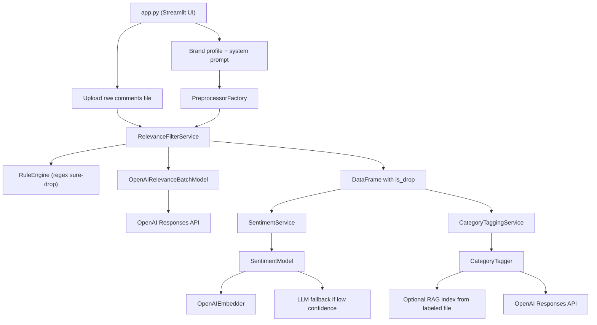

# Architecture

## 1. Quick Mental Model

Проект состоит из одного UI-оркестратора и трёх аналитических блоков:

1. `Relevance`:
   решает, относится ли комментарий к бренду (`keep/drop`)
2. `Sentiment`:
   определяет тональность релевантных комментариев
3. `Category tagging`:
   присваивает одну тематическую категорию комментарию

Главная точка входа одна:

- `app.py`:
  Streamlit UI, orchestration, загрузка файлов, вызов всех пайплайнов

## 2. File Map By Responsibility

### UI / orchestration

- `app.py`
  Главный файл приложения. Здесь собирается UI, читаются входные файлы, создаются сервисы, запускаются пайплайны.

### Relevance pipeline

- `filter_service.py`
  Основной runtime-сервис relevance. Сначала применяет жёсткие правила, потом отправляет оставшиеся тексты в LLM.
- `llm_model.py`
  Обёртка над OpenAI Responses API для batch-классификации `keep/drop`.
- `processing.py`
  Предобработка текста перед LLM: чистка, вырезание шума, выделение полезного окна текста.
- `brands.yaml`
  Профили брендов и deterministic regex-правила для `drop`.
- `brands_template.yaml`
  Шаблон для добавления нового бренда.
- `rule_agent.py`
  AI-генератор regex-правил для профиля бренда.

### Sentiment pipeline

- `sentiment_service.py`
  Тонкий сервисный слой над `SentimentModel`.
- `sentiment_model.py`
  Основная логика sentiment: embeddings, prototype-based inference, thresholds, LLM fallback.
- `embedders.py`
  Провайдеры эмбеддингов:
  `OpenAIEmbedder` и `SentenceTransformerEmbedder`.
- `sentiment_assets/`
  Runtime-артефакты sentiment-модели (`.npz`, `.yaml`).

### Category pipeline

- `category_service.py`
  Сервисный слой для категоризации файла.
- `category_model.py`
  Построение RAG-индекса, retrieval ближайших примеров, сбор prompt и вызов LLM.

### Training / scripts / misc

- `train_sentiment.py`
  Обучение sentiment-артефактов и сохранение в `sentiment_assets/`.
- `sentiment_train.xlsx`
  Пример/источник обучающих данных для sentiment.
- `test_batch.py`
  Утилитарный скрипт для пакетной проверки. Не отражает полный основной UI-flow.

### Config / secrets

- `requirements.txt`
  Зависимости runtime-приложения.
- `requirements_train.txt`
  Дополнительные зависимости для обучения.
- `config_local.py`
  Локальный fallback для `OPENAI_API_KEY`.
- `.streamlit/secrets.toml`
  Основной локальный способ передать ключ в Streamlit.

## 3. Runtime Architecture

## 4. Main Entry Point

Главный runtime начинается в `StreamlitBrandAnalyticsApp.run()` внутри `app.py`.

Этот метод делает четыре вещи:

1. Собирает настройки из sidebar
2. Собирает карточку бренда
3. Собирает `system prompt` для relevance
4. Даёт выбрать один из двух инструментов:
   `Relevance + Sentiment` или `Category tagging`

`app.py` не содержит бизнес-логику моделей целиком.
Он выступает как orchestrator.

## 5. Relevance + Sentiment Flow

### Шаг 1. Входной файл

Пользователь загружает CSV/XLSX с обязательной колонкой `Текст`.

Чтение файла:

- `app.py -> read_uploaded_table()`

### Шаг 2. Карточка бренда

Из `brands.yaml` или manual-режима собирается `profile`:

- `brand_name`
- `description`
- `aliases`
- `drop_categories`
  Каждая категория хранит `name`, `description`, `patterns`

### Шаг 3. System prompt для relevance

Базовый template хранится в:

- `app.py -> BASE_SYSTEM_TEMPLATE`

Финальный prompt собирается функцией:

- `app.py -> format_system_prompt()`

В prompt подставляются:

- имя бренда
- описание бренда
- алиасы бренда

### Шаг 4. Предобработка текста

`PreprocessorFactory` в `app.py` создаёт экземпляр `CommentPreprocessor` из `processing.py`.

Важно:

- brand aliases преобразуются в regex через `build_brand_patterns()`
- затем эти паттерны записываются в глобальный `processing.BRAND_PATTERNS`

То есть `processing.py` зависит от runtime-brand context.

### Шаг 5. Deterministic rules

`RelevanceFilterService.classify_many_parallel()` в `filter_service.py` сначала прогоняет каждый комментарий через:

- `RuleEngine.sure_drop()`

`RuleEngine` сначала пытается использовать новую структуру:

- `drop_categories: [{name, description, patterns}, ...]`

Если её нет, он падает обратно на legacy-поля в `brands.yaml`.

Если находится совпадение по regex, комментарий сразу получает:

- `action = drop`
- `source = rule`

LLM в этом случае не вызывается.

### Шаг 6. LLM relevance

Если regex ничего не нашли:

1. текст предобрабатывается
2. тексты собираются в батчи
3. батчи отправляются в `OpenAIRelevanceBatchModel.classify_batch()`

`llm_model.py` отвечает за:

- user prompt для batch-формата
- structured output
- retries
- latency measurement

На выходе получается список `keep/drop` по индексам строк.

### Шаг 7. Формирование результата relevance

`app.py` превращает `keep/drop` в колонку:

- `is_drop = Yes/No`

### Шаг 8. Sentiment

Если sentiment включён:

1. `app.py` вызывает `_build_sentiment_service()`
2. тот читает метаданные артефактов из `sentiment_assets/*.yaml`
3. затем создаёт `SentimentModel` через `get_sentiment_model_cached()`
4. в модель прокидывается `OpenAIEmbedder`
5. `SentimentService.predict_many()` вызывает `SentimentModel.predict_texts()`

Как принимает решение sentiment-модель:

1. строит embeddings текста
2. сравнивает их с prototype-centroids из `.npz`
3. применяет thresholds
4. если уверенности не хватает и `enable_llm_fallback=True`, спрашивает LLM

В выходной DataFrame добавляются:

- `sentiment`
- `sentiment_source`

## 6. Category Tagging Flow

### Входы

Category tagging принимает:

1. основной input-файл с колонкой `Текст`
2. опционально колонку `is_drop`
3. опционально labeled dataset для RAG с колонками:
   `Текст`, `Категория`
4. обязательный category prompt (`user_prompt`)

### Шаг 1. Источник входа

Вход для категорий бывает двух видов:

- предыдущий output relevance/sentiment из session state
- новый загруженный файл

### Шаг 2. Предобработка

Для всех текстов вызывается тот же preprocessor pipeline, что и для relevance.

### Шаг 3. Skip logic

Если есть колонка `is_drop` и строка помечена как `Yes`, комментарий не категоризируется.

### Шаг 4. Optional RAG

Если пользователь загрузил labeled dataset:

1. `CategoryTagger.build_index()` строит embedding index
2. `CategoryTagger.retrieve_neighbors()` находит top-k похожих примеров
3. список разрешённых категорий берётся из референсного файла

### Шаг 5. LLM category classification

`CategoryTagger.classify_batch_llm()` собирает prompt из:

- `user_prompt`
- списка разрешённых категорий
- самих комментариев
- похожих примеров, если включён RAG

После ответа модели:

- JSON парсится
- если category не совпала идеально, `_best_match_to_allowed()` пытается приблизить её к одной из разрешённых категорий

### Шаг 6. Формирование результата

В выходной DataFrame добавляются:

- `Категория_pred`
- `Категория_source`

## 7. Where To Edit What

### Если нужно изменить смысл `keep/drop`

Редактировать:

- `app.py -> BASE_SYSTEM_TEMPLATE`
- UI-блок `System prompt template`

### Если нужно изменить deterministic `drop`

Редактировать:

- `brands.yaml -> drop_categories`

Или сгенерировать через:

- `rule_agent.py`
- UI-блок `Авто-генерация правил (AI)`

Важно:

- AI-generated rules сейчас сохраняются только в session state
- автоматически обратно в `brands.yaml` они не пишутся

### Если нужно изменить category taxonomy

Редактировать:

- поле `Category definitions prompt`
- опционально labeled RAG dataset

### Если нужно изменить sentiment

Редактировать/переобучать:

- `train_sentiment.py`
- `sentiment_train.xlsx`
- `sentiment_assets/*`

## 8. Training vs Inference

### Inference runtime

Файлы:

- `app.py`
- `filter_service.py`
- `llm_model.py`
- `processing.py`
- `sentiment_service.py`
- `sentiment_model.py`
- `category_service.py`
- `category_model.py`
- `embedders.py`
- `brands.yaml`
- `sentiment_assets/*`

### Training / asset generation

Файлы:

- `train_sentiment.py`
- `sentiment_train.xlsx`

Тренировочный пайплайн сейчас отделён от UI и запускается вручную.

## 9. Current Pain Points

Сейчас основные источники путаницы такие:

1. `app.py` слишком большой:
   UI, orchestration, config, prompt assembly и часть preprocessing factory живут в одном месте.
2. `processing.py` использует глобальный mutable `BRAND_PATTERNS`:
   это скрытая runtime-зависимость.
3. Правила брендов лежат в YAML, но AI-generated overrides живут только в session state:
   из-за этого конфигурация не имеет одного постоянного источника правды.
4. В проекте одновременно поддерживаются новый `drop_categories` и legacy-ключи:
   это полезно для совместимости, но усложняет ментальную модель.
5. Sentiment и category используют тот же preprocessing-слой, но это неочевидно без чтения `app.py`.
6. `test_batch.py` идёт по упрощённому пути и не отражает весь production flow.

## 10. Suggested Next Refactor

Если продолжать структурирование, следующий разумный шаг такой:

1. Вынести Streamlit orchestration из `app.py` в отдельные модули:
   `ui_relevance.py`, `ui_categories.py`, `ui_brand_profile.py`
2. Вынести конфиг и prompt assembly в отдельный модуль:
   `brand_config.py`
3. Вынести application-level use cases:
   `pipelines/relevance_pipeline.py`
   `pipelines/category_pipeline.py`
4. Убрать запись в глобальный `processing.BRAND_PATTERNS` и передавать brand patterns явно

Это уже будет настоящая структурная чистка, а не только документация.
